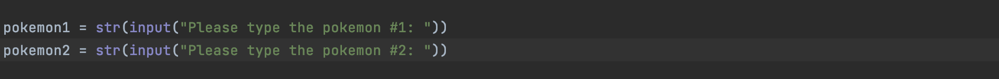
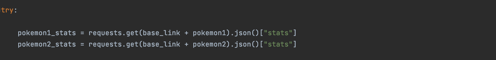
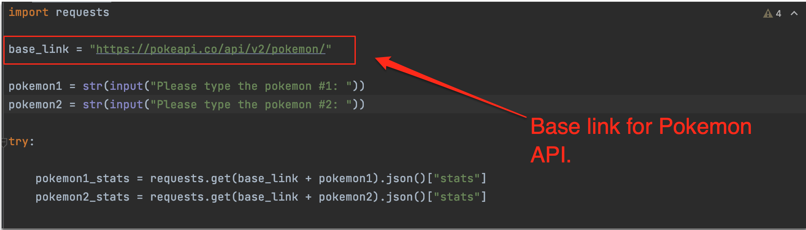
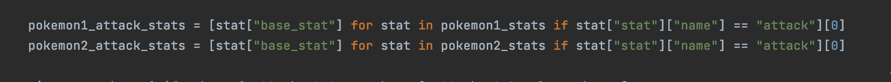
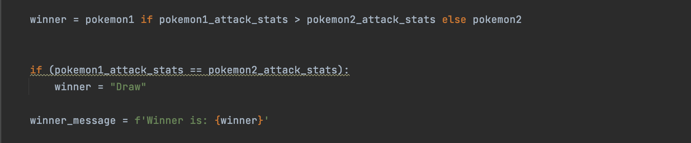
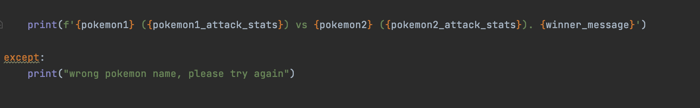
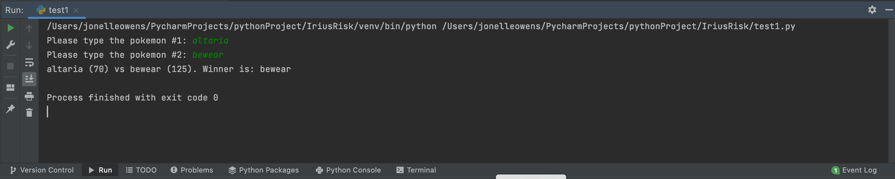

# Python_Pokemon_Script

### Step 1: 
 I used the input function in Python to allow the program to ask the user for an input name.

### Step 2: 
Perform a pokemon API call.

### Step 3: 

In order to perform a request, I am using something called "requests" that is a Python library to do the web api requests.

In this case I am calling a [base_link](https://pokeapi.co/api/v2/pokemon/) , which is the api link for the pokeapi

### Step 4:

After receiving the attributes from the API, and in order to get que stats, I use the ["stats"] attribute.
Then, after receiving all of the stats, I used this:

The above picture shows that I am only getting the attack stats.

### Step 5:

Compare the base_stat values from each pokemon.

### Step 6:  
Final line of code to print results:

## Output:

